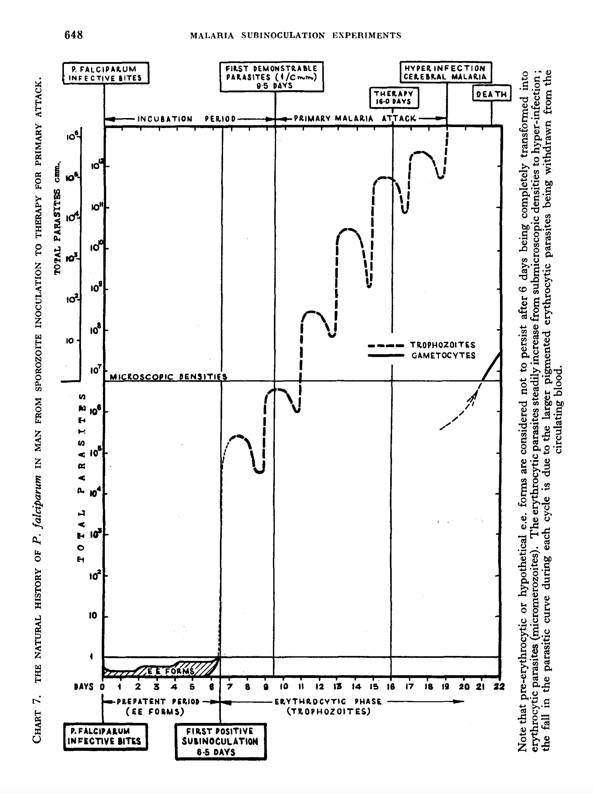

# Andrade_replication

The code in this repository is a re-analysis of RNA seq data from Andrade et al and some simulations to test sensitivity of the underlying algorithm that estimates the hours post invasion (hpi) from in vivo transcriptomics data.

Key messages:

* Comparisons of developmental stages in asymptomatic and symptomatic patients are confounded by selection bias (fever in uncomplicated malaria influences treatment seeking behaviour; fever synchronises the infection; fever can trigger cytoadherence; patients are selected on the basis of parasitaemia). A key difference is synchronicity of the parasite stages across infected red cells: asymptomatics are probably very asynchronousl symptomatics are probably highly synchronous (especially if you select patients on the basis of high parasitaemia).
* Andrade et al have not explored the influence of gametocyte gene expression: gametocyte proportions in asymptomatics will be much higher than in symptomatics
* The maximum likelihood method from Lemieux et al used to estimate hpi basically breaks down when you simulate asynchronous infections (give wildly biased results)

## Synchronicity of infection

Brigadier Sir Neil Hamilton Fairley did some pretty cool experiments at the Cairns experimental station (Sidelights on malaria in man obtained by subinoculation experiments, 1947). Vivax doesn't sequester and he showed a log-linear increase in parasite densities. Falciparum does sequester so we see a sine-wave increase in parasite densities:

The sine-wave pattern is explained by two things:

* Sequestration of mature stages (large rings onwards)
* Relative synchronicity of infection (helped by fever) - if the infection was not synchronous we would not see the sine-wave (cancelled out by the variance in ages)

## Simulations

We simulate transcriptomics data using the reference dataset from Bozdech et al. The simulation algorithm does the following:

* Input: a mean age $\mu\in[0,48]$; a standard deviation in age $\sigma>0$; a vector of circulation probabilities for each hour 0 until 48.
* We calculate the proportion of parasites ages for each hourly block from 0 to 48 under the assumption that the parasite ages are normally distributed with mean $\mu$ and variance $\sigma^2$, modulo 48.
* We then sample parasites from the expected hourly blocks and use the reference transcriptome to construct an aggregate trancriptional profile
* We do the same but after multiplying the expected proportions per hour by the circulating probabilities
* We compute the mle using the method from Lemieux et al on both simulated gene expression datasets

