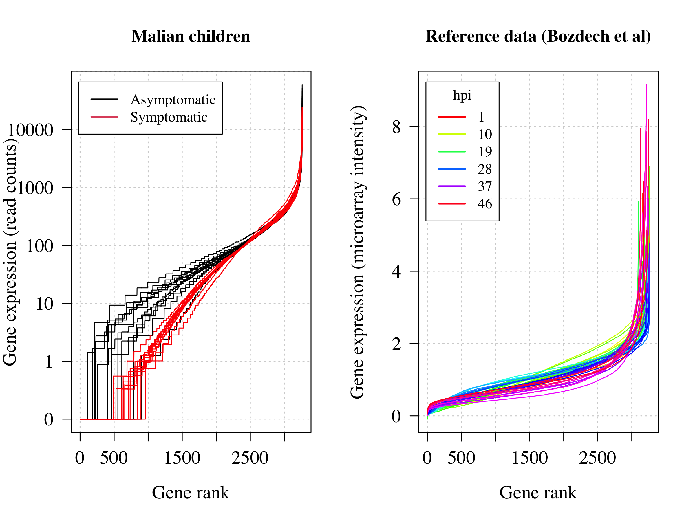
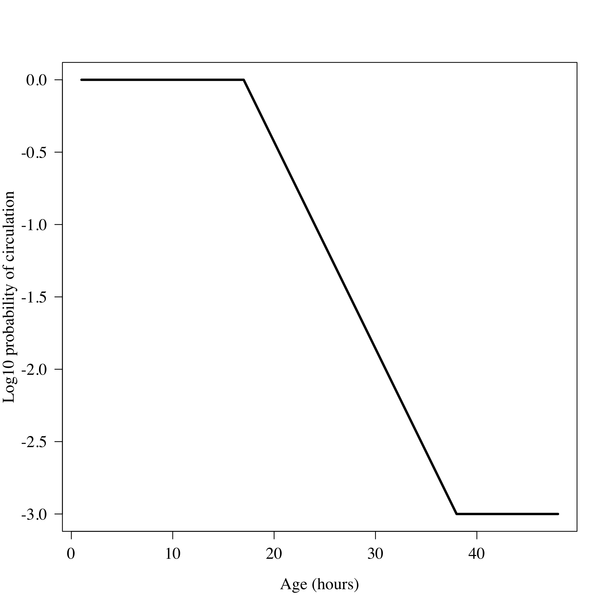

Session info


```
## R version 4.0.2 (2020-06-22)
## Platform: x86_64-apple-darwin17.0 (64-bit)
## Running under: macOS  10.16
## 
## Matrix products: default
## BLAS:   /Library/Frameworks/R.framework/Versions/4.0/Resources/lib/libRblas.dylib
## LAPACK: /Library/Frameworks/R.framework/Versions/4.0/Resources/lib/libRlapack.dylib
## 
## locale:
## [1] en_US.UTF-8/en_US.UTF-8/en_US.UTF-8/C/en_US.UTF-8/en_US.UTF-8
## 
## attached base packages:
## [1] parallel  stats     graphics  grDevices utils     datasets  methods  
## [8] base     
## 
## other attached packages:
## [1] tictoc_1.0.1      doParallel_1.0.16 iterators_1.0.13  foreach_1.5.1    
## 
## loaded via a namespace (and not attached):
##  [1] codetools_0.2-18 digest_0.6.28    R6_2.5.1         jsonlite_1.7.2  
##  [5] magrittr_2.0.1   evaluate_0.14    rlang_0.4.12     stringi_1.7.5   
##  [9] jquerylib_0.1.4  bslib_0.3.1      rmarkdown_2.11   tools_4.0.2     
## [13] stringr_1.4.0    xfun_0.27        yaml_2.2.1       fastmap_1.1.0   
## [17] compiler_4.0.2   htmltools_0.5.2  knitr_1.36       sass_0.4.0
```


## Get data and make analysis ready datasets

We download two datasets:

* The *P. falciparum* reference transcriptome from Bozdech *et al* (hosted on the PLoS Biology website)
* RNA seq data from Andrade et al: hosted on Gene Expression Omnibus (GEO), accession number GSE148125


We need to do some cleaning so that the gene names across the two datasets can be matched. This may not be optimal or fully correct but it seems to give a reasonable number of matches.


## Analysis using method by Lemieux et al


Lemieux et al (PNAS, 2008) proposed a simple approach for estimating the hours post invasion (hpi) for an in vivo sample. The reference data $z$ from Bozdech et al can be thought of a cyclical process $z_g$ for each gene $g$. They proposed first to estimate $z_g$ using smoothing splines. Then the "distance" of the data $x$ and the reference genome at each timepoint $t\in [0,48]$ can be calculated as the sum of squared residuals $z_g(t) - x_g$ (i.e. Gaussian likelihood for the residuals). The MLE $t^*$ is then the value of $t$ that minimises these residuals.

A key issue is that the reference data $z$ and the testing data $x$ are not in the same units. The reference data are microarray data (intensity values on a microarray); the data from Andrade et al are RNA seq data: Illumina read counts (going from 0 to around 100,000).

We use the original code written by Avi Feller (R script *Avi_Feller_functions.R*).
The file *Asymptomatic_data_Original.csv* contain the data supplied by the authors used in the original analysis. We use it to replicate the original results for the hours post invasion which were wrong.


```
## There are 3262 gene names that match across Bozdech reference transcriptome and the Andrade et al RNA seq dataset
```

<!-- -->

```
## The difference between the median values in each group is 4.45 hours
```

## Gene expression is more consistent with asynchrony in the asymptomatics


<!-- -->


## Simulations: sensitivity to asynchrony


A population of parasites within a host are never in complete synchrony (i.e. not all at exactly the same developmental stage).
In symptomatic malaria we do usually see quite synchronous infections, for example the work by Fairley (1947) showed that parasitaemia over time followed an increasing sine-wave pattern. This is driven by concurrent schizogony followed by sequestration.
Synchronicity in symptomatic malaria is partly driven by fever (see Kwiatkowski. Febrile temperatures can synchronize the growth of Plasmodium falciparum in vitro. J Exp Med. 1989).


<!-- -->


<!-- -->

